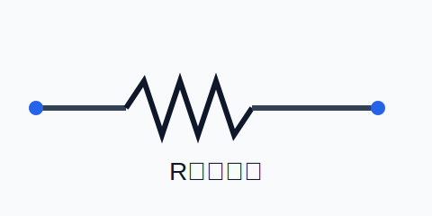
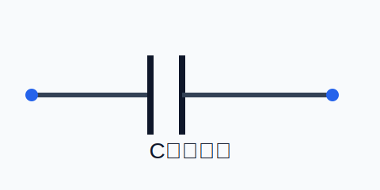
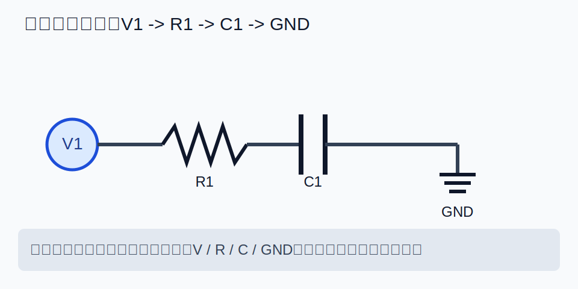

# Circuit Dataset Tool（电路图数据集生成工具）

> 面向电路图样本的**交互式构建 + 自动标注 + 数据集落盘**工具。前端负责可视化编辑与导出，后端（FastAPI，无头）负责算法计算、校验与数据落盘。

---

## 1. 你能用它做什么

- 在浏览器中拖拽元器件、连线，形成 `scene.json`
- 手绘遮挡或调用后端生成不规则 `mask.png`
- 调用后端计算遮挡率与可见计数，生成 `label.json`
- 可选：在保持 netlist 不变的前提下 shuffle 布局（用于数据增强）
- 保存为标准数据集目录结构，并维护 `manifest.jsonl` 索引

---

## 2. 项目结构（推荐）

```
circuit_dataset_tool/
├── shared/
│   ├── vocab.json
│   ├── scene.schema.json
│   ├── label.schema.json
│   └── footprints/
├── backend/
│   ├── app/
│   ├── dataset_output/          # 默认输出目录
│   └── requirements.txt
└── frontend/
    ├── package.json
    └── src/
```

> 注意：`shared/` 是前后端一致性的“单一事实来源”（vocab / schema / footprints）。

---

## 3. 环境要求

- Python 3.10+（建议 3.11）
- Node.js 18+（前端 Vite）
- （可选）系统依赖：如你需要构建某些 Python 包，可能需要 `build-essential` 等编译工具

---

## 4. 快速开始（本地开发）

### 4.1 启动后端（FastAPI）

```bash
cd circuit_dataset_tool

python -m venv .venv
# Windows: .venv\Scripts\activate
source .venv/bin/activate

pip install -U pip
pip install -r backend/requirements.txt

# 启动（默认 http://127.0.0.1:8000）
uvicorn backend.app.main:app --reload --host 0.0.0.0 --port 8000
```

验证后端：

- 健康检查：`GET http://127.0.0.1:8000/healthz`
- OpenAPI 文档：`GET http://127.0.0.1:8000/api/v1/docs`

### 4.2 启动前端（Vite）

```bash
cd frontend
npm install
npm run dev
```

打开终端输出的地址（通常是 `http://127.0.0.1:5173`）。

---


## 5. 端到端示例：从 0 到 1 生成一个样本

> 目标：让新用户可以**照抄步骤一次跑通**。每一步都按「命令 + 页面操作 + 预期结果（验收点）」执行。

### 5.1 前置条件

- **软件版本**
  - Python `3.10+`（推荐 `3.11`）
  - Node.js `18+`
- **目录位置**
  - 仓库根目录：`circuit_dataset_tool/`
- **端口说明**
  - 后端 FastAPI：`8000`
  - 前端 Vite：`5173`（实际以终端输出为准）
- **默认地址约定**
  - 后端服务根地址：`http://127.0.0.1:8000`
  - 前端配置 Base URL（含 API 前缀）：`http://127.0.0.1:8000/api/v1`

### 5.2 启动后端（命令 + 验收）

**命令（在仓库根目录执行）：**

```bash
cd circuit_dataset_tool
python -m venv .venv
source .venv/bin/activate   # Windows: .venv\Scripts\activate
pip install -U pip
pip install -r backend/requirements.txt
uvicorn backend.app.main:app --reload --host 0.0.0.0 --port 8000
```

**页面/浏览器操作：**

1. 打开 `http://127.0.0.1:8000/healthz`
2. 打开 `http://127.0.0.1:8000/api/v1/docs`

**预期结果（验收点）：**

- `/healthz` 返回健康 JSON（如 `{"ok": true}` 或等价健康字段）
- `/api/v1/docs` 能看到 Swagger UI 页面
- 后端终端出现 `Uvicorn running on ...:8000` 且无启动报错

### 5.3 启动前端（命令 + 验收）

**命令（新开一个终端）：**

```bash
cd circuit_dataset_tool/frontend
npm install
npm run dev
```

**页面/浏览器操作：**

1. 打开终端提示地址（通常为 `http://127.0.0.1:5173`）

**预期结果（验收点）：**

- 页面可正常加载
- 页面右上角可以看到 Base URL 输入框与 `Health` 按钮

### 5.4 页面内完整操作示例（逐步）

> 以下步骤必须按顺序做，示例电路使用：`V -> R -> C -> GND`。

#### 步骤 1：设置 Base URL

- **页面操作**：在右上角 `后端 Base URL` 输入 `http://127.0.0.1:8000/api/v1`
- **预期结果（验收点）**：输入框值更新成功，后续请求都发往该地址

#### 步骤 2：点击 Health

- **页面操作**：点击 `Health`
- **预期结果（验收点）**：状态日志出现健康检查成功（如 `health ok` / `200`）

#### 步骤 3：新建场景

- **页面操作**：点击 `新建`
- **预期结果（验收点）**：画布清空，右侧/底部状态日志出现新建成功提示

#### 步骤 4：添加器件并连线（V -> R -> C -> GND）

- **页面操作**：
  1. 在器件库依次添加 `V`、`R`、`C`、`GND`
  2. 拖拽排布到画布，从左到右放置
  3. 使用连线操作连接为 `V -> R -> C -> GND`
- **预期结果（验收点）**：
  - 画布上可见 4 个器件
  - 连线关系完整无断开
  - `导出 scene.json` 后文件中包含对应 `nodes` 与 `nets`

#### 步骤 5：切换到 Mask 编辑并涂抹遮挡

- **页面操作**：点击 `Mask 编辑`，在 `R` 或 `C` 上涂抹一小块遮挡
- **预期结果（验收点）**：画布出现可见遮挡区域（黑色/半透明遮挡层）

#### 步骤 6：计算 Label

- **页面操作**：点击右侧 `计算 Label`
- **预期结果（验收点）**：
  - 状态日志显示计算成功
  - 右侧 label 区域出现 JSON，至少包含 `counts_visible` 字段
  - 若遮挡有效，`occlusion` 列表包含被遮挡器件条目

#### 步骤 7：导出 image/mask/scene

- **页面操作**：依次点击 `导出 image.png`、`导出 mask.png`、`导出 scene.json`
- **预期结果（验收点）**：浏览器下载目录中出现三个文件，文件名分别为：
  - `image.png`
  - `mask.png`
  - `scene.json`

#### 步骤 8：保存到后端数据集

- **页面操作**：点击 `保存到后端数据集`
- **预期结果（验收点）**：
  - 页面状态日志出现保存成功（返回 sample id 或路径）
  - 后端 `backend/dataset_output/` 下出现新样本子目录
  - `manifest.jsonl` 追加一条新记录

### 5.5 常见报错对照表（直接处理动作）

| 问题现象 | 常见原因 | 直接处理动作 |
|---|---|---|
| Health 失败，提示网络错误或 404 | Base URL 填错（缺少 `/api/v1`、端口错、协议错） | 把 Base URL 改为 `http://127.0.0.1:8000/api/v1`，再点 `Health` |
| 所有接口都失败/连接拒绝 | 后端未启动或已退出 | 回到后端终端重启 `uvicorn ... --port 8000`，确认 `/healthz` 可访问 |
| 计算 Label 报错（mask 为空/无效） | 没有实际涂抹遮挡，或导入了全空白 mask | 切到 `Mask 编辑` 重新涂抹可见区域，再次点击 `计算 Label` |

### 5.6 最终产物清单（一次成功流程后）

> 以下文件是“跑通一次流程”后建议核对的最小集合。

- **浏览器下载目录**（通常 `~/Downloads`）：
  - `image.png`
  - `mask.png`
  - `scene.json`
- **后端输出目录**（默认）：
  - `backend/dataset_output/manifest.jsonl`
  - `backend/dataset_output/<sample_id>/image.png`
  - `backend/dataset_output/<sample_id>/mask.png`
  - `backend/dataset_output/<sample_id>/scene.json`
  - `backend/dataset_output/<sample_id>/label.json`

## 6. 前端使用说明（零代码基础版）

下面这部分按“普通用户只会点网页按钮”的方式来写，你不需要会编程。

### 6.1 第一次打开页面后先做这 3 件事

1. 看右上角 `后端 Base URL`，默认填 `http://localhost:8000/api/v1`。
2. 点击右上角 `Health`。
3. 如果状态栏提示成功，就可以开始画图；如果失败，先确认后端是否已启动。

### 6.2 最常用按钮（先认识再操作）

- 顶栏：
  - `新建`：清空当前电路和遮挡层。
  - `导入 scene.json` / `导出 scene.json`：读取或保存电路结构。
  - `电路编辑` / `Mask 编辑`：切换“画电路”与“画遮挡”。
  - `导出 image.png` / `导出 mask.png`：导出图像。
  - `导出本地样本包`：打包下载最小样本。
- 左栏：
  - `器件库`：搜索并添加器件（如 R、C、V、GND）。
  - `Mask 工具`：涂抹/擦除/自动生成遮挡区域。
- 右栏：
  - `校验 Scene`：检查场景是否合法。
  - `计算 Label`：根据当前 mask 计算标注结果。
  - `Shuffle`：保持连线关系不变，自动换布局。
  - `保存到后端数据集`：把 image/mask/scene/label 一起落盘。

### 6.3 一次完整操作（建议严格按顺序）

1. **点击 `新建`**，保证画布干净。
2. 在左侧 `器件库` 搜索 `R`，点击添加一个电阻；再搜索 `C` 添加一个电容。
3. 鼠标拖拽器件到合适位置（例如从左到右）。
4. **连线**：从一个器件引脚拖到另一个器件引脚。
5. 点击 `导出 scene.json` 先保存一次结构。
6. 切到 `Mask 编辑` 模式，使用 `涂抹` 在器件上画一点遮挡（黑色区域）。
7. 点击 `计算 Label`，右侧会出现 JSON 结果。
8. 需要增强数据时点击 `Shuffle`，系统会自动换布局。
9. 最后点击 `导出 image.png`、`导出 mask.png`、`导出 scene.json`（以及右侧 `保存到后端数据集`）。

### 6.4 常见问题（给非技术用户）

- **点了按钮没反应**：先看网页底部/右侧状态日志，通常会提示具体失败原因。
- **Health 失败**：大概率后端没启动，或者 Base URL 写错。
- **算 Label 报错**：通常是没有有效 mask，先在 `Mask 编辑` 中手动画几笔再试。
- **导入失败**：请确认文件名和类型匹配（`scene.json` 用导入 scene，`mask.png` 用导入 mask）。

### 6.5 基础器件预设图片（最小功能演示可直接参考）

> 这些图用于“先照着摆出来跑通流程”。你可以按图先做最小演示，再做复杂电路。

- 电阻（R）：



- 电容（C）：



- 最小连通示例（V1 -> R1 -> C1 -> GND）：



### 6.6 “最小可跑通”演示清单

按下面做，你应该能在 3~5 分钟内看到完整结果：

1. 添加 `V`、`R`、`C`、`GND` 四类器件。
2. 连成一条链：`V -> R -> C -> GND`。
3. 切到 `Mask 编辑`，在 `R` 上轻涂一块遮挡。
4. 点击 `计算 Label`，确认右侧出现 `counts_visible` / `occlusion`。
5. 点击 `导出 image.png`、`导出 mask.png`、`导出 scene.json`。

---

## 7. 推荐使用流程（UI 端到端）

1) **绘制电路**：拖拽器件 + 连线（nodes/nets），得到 `scene.json`  
2) **准备 mask**：  
   - 方式 A：前端手绘遮挡并导出 `mask.png`  
   - 方式 B：调用后端 `/mask/generate` 自动生成并在前端预览/保存  
3) **计算 label**：调用后端 `/label/compute`，得到 `label.json`（含 occlusion 明细与 `counts_visible`）  
4) **可选 shuffle**：调用 `/topology/shuffle` 得到新 `scene.json`，再重复步骤 2-3  
5) **保存样本**：调用 `/dataset/save` 或 `/dataset/save_json`，自动生成样本目录并追加写入 `manifest.jsonl`

---

## 8. 后端 API（最小集合）

> 默认前缀：`/api/v1`

### 8.1 校验 scene

**POST** `/scene/validate`

请求体（示例）：

```json
{
  "scene": { "meta": {}, "nodes": [], "nets": [] },
  "strict": false
}
```

返回：`{ "ok": true, "scene": <normalized_scene>, "warnings": [...] }`（具体字段以 OpenAPI 为准）

---

### 8.2 生成不规则 mask（自动遮挡）

**POST** `/mask/generate`

请求体（示例）：

```json
{
  "scene": { "meta": { "seed": 123, "resolution": { "w": 1024, "h": 1024 } }, "nodes": [], "nets": [] },
  "strategy": "value_noise",
  "params": { "ratio": 0.2, "focus": 0.3 },
  "return_bytes": false
}
```

返回（JSON 模式）：`{ "mask_png_base64": "...", "meta": {...} }`

#### 已内置策略（当前实现）

- `value_noise`：平滑噪声阈值化生成 blob
- `strokes`：随机游走笔触叠加

常用参数（策略通用）：

- `ratio`：遮挡比例（0~1）
- `focus`：是否更偏向在器件附近采样（0~1，0 表示完全均匀）
- `focus_sigma` / `focus_jitter`：聚焦采样的尺度与抖动

---

### 8.3 计算 label（遮挡率 + 可见计数）

**POST** `/label/compute`

请求体（示例）：

```json
{
  "scene": { "meta": { "resolution": { "w": 1024, "h": 1024 } }, "nodes": [], "nets": [] },
  "mask_png_base64": "iVBORw0KGgoAAA...",
  "occ_threshold": 0.9,
  "function": "ADC"
}
```

返回（示例结构）：

```json
{
  "label": {
    "label_version": "0.3",
    "counts_all": { "R": 2, "C": 2 },
    "counts_visible": { "R": 2, "C": 1 },
    "occlusion": [ { "node_id": "n1", "type": "R", "occ_ratio": 0.12 } ],
    "occ_threshold": 0.9,
    "function": "ADC"
  }
}
```

> 说明：mask 必须与 `scene.meta.resolution` 一致，否则会报错。

---

### 8.4 shuffle 布局（保持 netlist 不变）

**POST** `/topology/shuffle`

请求体（示例）：

```json
{
  "scene": { "meta": { "seed": 123 }, "nodes": [], "nets": [] },
  "params": { "margin": 40 },
  "return_paths": true
}
```

返回：`{ "scene": <shuffled_scene>, "meta": {...} }`

---

### 8.5 保存样本到数据集（落盘 + 更新 manifest）

#### A) multipart 方式（推荐：直接上传四个文件）

**POST** `/dataset/save`（multipart/form-data）

字段：

- `image`: `image.png`
- `mask`: `mask.png`
- `scene`: `scene.json`
- `label`: `label.json`
- `sample_id`（可选）：例如 `sample_000123`

示例（bash）：

```bash
curl -X POST "http://127.0.0.1:8000/api/v1/dataset/save" \
  -F "image=@image.png" \
  -F "mask=@mask.png" \
  -F "scene=@scene.json" \
  -F "label=@label.json" \
  -F "sample_id=sample_000001"
```

#### B) JSON 方式（base64）

**POST** `/dataset/save_json`

请求体（示例）：

```json
{
  "image_png_base64": "iVBORw0KGgoAAA...",
  "mask_png_base64": "iVBORw0KGgoAAA...",
  "scene": { "...": "..." },
  "label": { "...": "..." },
  "sample_id": "sample_000001"
}
```

返回（示例）：

```json
{ "ok": true, "sample_id": "sample_000001", "saved_paths": { "image": "...", "mask": "...", "scene": "...", "label": "..." } }
```

---

## 9. 数据集输出格式

默认输出目录：`backend/dataset_output/`

单样本目录结构：

```
backend/dataset_output/
  sample_000001/
    image.png
    mask.png
    scene.json
    label.json
  manifest.jsonl
```

`manifest.jsonl` 为 append-only 的 JSON Lines 索引文件，每行对应一个样本的关键信息（sample_id、paths、function、counts_visible、seed、版本号与时间戳等）。

---

## 10. 配置（环境变量 / .env）

后端支持 `CDT_` 前缀环境变量覆盖（也可在项目根目录放 `.env`）：

- `CDT_API_PREFIX`：API 前缀（默认 `/api/v1`）
- `CDT_DATASET_ROOT`：数据集输出根目录（默认 `backend/dataset_output`）
- `CDT_VOCAB_PATH`：`shared/vocab.json` 路径
- `CDT_FOOTPRINT_DIR`：`shared/footprints/` 目录
- `CDT_MANIFEST_PATH`：manifest 路径（默认 `<DATASET_ROOT>/manifest.jsonl`）
- `CDT_DEFAULT_OCC_THRESHOLD`：默认遮挡阈值（默认 0.9）
- `CDT_DEFAULT_RESOLUTION_W/H`：默认分辨率（默认 1024x1024）
- `CDT_ENABLE_JOBS`：是否启用批处理 jobs（可选）
- `CDT_CORS_ALLOW_ORIGINS`：CORS 白名单来源（默认 `http://127.0.0.1:5173,http://localhost:5173`）
- `CDT_CORS_ALLOW_CREDENTIALS`：是否允许携带凭证（默认 `false`）

示例（Linux/macOS）：

```bash
export CDT_DATASET_ROOT=./backend/dataset_output
export CDT_DEFAULT_OCC_THRESHOLD=0.85
export CDT_CORS_ALLOW_ORIGINS=http://127.0.0.1:5173,http://localhost:5173
export CDT_CORS_ALLOW_CREDENTIALS=false
uvicorn backend.app.main:app --reload
```

---

## 11. 常见问题（FAQ）

### Q0：快速开始阶段常见故障排查（先看这里）

- **路径错误（例如写成 `/home/liyk/...`）**  
  请先执行 `pwd` 确认当前项目根目录，再使用相对路径进入：
  `cd /你的实际路径/circuit_dataset_tool`，避免照抄他人机器上的绝对路径。
- **前端缺少 `package.json`**  
  如果 `frontend/package.json` 不存在，说明前端构建配置尚未补齐，`npm install` / `npm run dev` 会失败。请先补齐前端脚手架与入口文件。
- **Node 版本不满足要求**  
  本项目前端建议 Node.js **18+**。可用 `node -v` 检查；版本过低时请升级（推荐使用 nvm/fnm 管理多版本）。

### Q1：`VOCAB_MISMATCH` / `footprint template not found`
- 请确认 `shared/vocab.json` 中的 `type` 与 `shared/footprints/` 下模板命名一致，并且后端配置指向正确路径。

### Q2：`MASK_DECODE_ERROR: mask resolution does not match scene.meta.resolution`
- mask 图像宽高必须与 `scene.meta.resolution.w/h` 完全一致。建议统一使用 1024×1024（或在 scene 中显式记录分辨率）。

### Q3：保存成功但找不到 manifest
- 默认写入 `<DATASET_ROOT>/manifest.jsonl`。若你改了 `CDT_DATASET_ROOT` 或 `CDT_MANIFEST_PATH`，请检查实际路径与权限。

### Q4：前端能打开，但调用 API 跨域失败
- 请确认请求来源在 `CDT_CORS_ALLOW_ORIGINS` 白名单内（多个值可用英文逗号分隔）。
- 若你设置了 `CDT_CORS_ALLOW_CREDENTIALS=true`，则不能把来源配置为 `*`；必须使用显式来源（例如 `http://127.0.0.1:5173`）。
- 浏览器常见报错：`Credential is not supported if the CORS header 'Access-Control-Allow-Origin' is '*'`，说明凭证模式与通配符来源冲突。

---

## 12. 开发者说明（可选）

- 后端文档入口：`/api/v1/docs`
- 建议先确保 `shared/` 资源齐备（vocab + footprints），再逐步完善算法模块与前端交互。

---

## 13. 最小验收标准（MVP）

满足以下 4 条，即可认为“端到端最小可用”：

1. 前端页面可打开（开发地址可访问，无白屏、无阻塞性报错）。
2. 前端 **Health** 按钮/功能可成功请求后端健康检查接口（如 `GET /healthz`）。
3. 可从前端导出 `scene.json`。
4. 可从前端导出 `mask.png`（手绘或后端生成后保存均可）。

---
